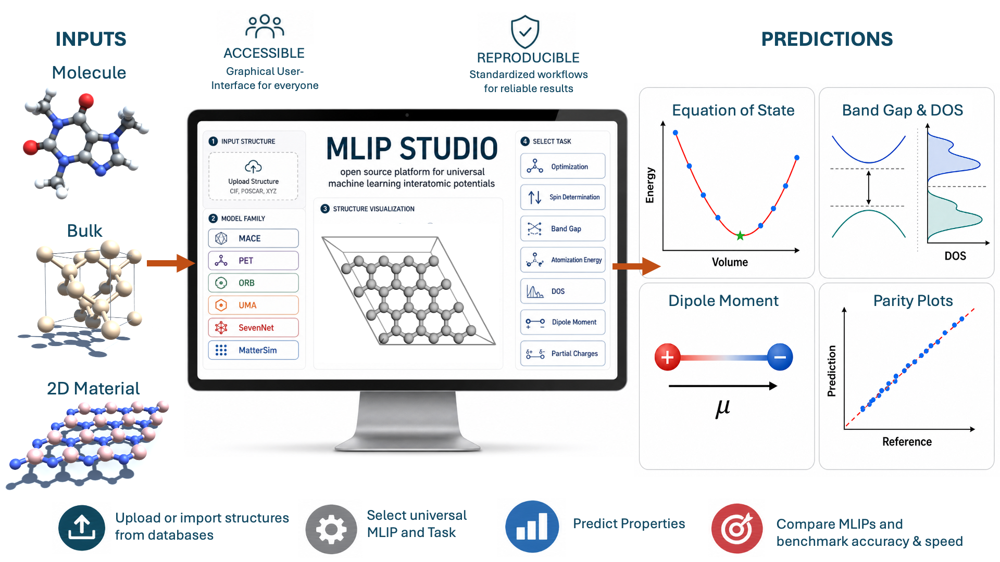

# MLIP Studio

**An open platform for interactive benchmarking and simulations using machine learning interatomic potentials**

MLIP Studio is a Streamlit-based web application for running, testing, comparing, and benchmarking universal machine learning interatomic potentials (MLIPs) for atomistic simulations of molecules and materials. It brings more than 60 pretrained MLIPs into a single graphical interface, so users can evaluate structures, compare models, run common simulation tasks, and benchmark against reference data without writing custom scripts for every model family.

The platform is designed for computational chemistry, materials science, MLIP model development, dataset diagnostics, and teaching. It combines model inference, 3D visualization, geometry optimization, trajectory analysis, and benchmarking tools in one workflow.




## Try It Online

MLIP Studio can be tried online for free at:

https://mlipstudio.iisc.ac.in

The hosted instance provides GPU acceleration and is intended for quick tests, demonstrations, education, and small-to-moderate systems. Because it is a shared public service, it has limits on system size and runtime.

For larger systems, unrestricted benchmarking, long calculations, or private datasets, users can download and install MLIP Studio locally. Local installation removes the cloud system-size limits and lets the application use the user's own CPU/GPU hardware.

## What MLIP Studio Does

Universal MLIPs are foundation models for atomistic simulation. They are trained on large quantum-mechanical datasets and can often be applied across broad chemical spaces without system-specific retraining. In practice, however, using several MLIP families side by side can be difficult because each model stack may require different dependencies, APIs, licenses, and data conventions.

MLIP Studio addresses this by providing a unified interface for model selection, structure input, calculation setup, result visualization, and benchmark analysis. Users can switch between model families in one session and compare predictions on the same molecules, crystals, slabs, interfaces, or trajectory datasets.

## Supported Features

| Area | Capabilities |
| --- | --- |
| Structure input | Built-in examples, file upload, pasted structure text, Materials Project ID import, PubChem import, batch upload, and extXYZ trajectory upload |
| Supported formats | XYZ, extXYZ, CIF, POSCAR/VASP, CONTCAR, MOL, SDF, and Turbomole-style molecular files, through ASE and related parsers |
| Visualization | Interactive 3D structure viewing with multiple styles such as ball-and-stick, stick, line, and space-filling representations |
| Model selection | Predefined universal MLIPs, custom MACE model upload, custom MACE model URL loading, UFF, D3 dispersion, xTB, and the in-house QM9 HOMO-LUMO gap model |
| Single-structure prediction | Energy, forces, stress, atomization energy, cohesive energy, HOMO-LUMO gap, band gap, density of states, dipole moment, partial charges, and Hessian-related outputs where supported |
| Geometry optimization | Molecular geometry optimization and cell plus geometry optimization using ASE optimizers including BFGS, BFGSLineSearch, LBFGS, LBFGSLineSearch, FIRE, GPMin, MDMin, FASTMSO, Lindh Hessian LBFGS, MACE Hessian LBFGS, and MACE-Seed LBFGS |
| Hessian-guided optimizers | Line-search-free Lindh Hessian, MACE Hessian, and MACE-Seed LBFGS methods. Across the 30-molecule Baker set with MACE OMAT Medium, MACE POLAR 1 L, and UMA OMOL s1.2 at `fmax=0.01 eV/A`, Lindh Hessian reduced mean optimization cycles by 71.8% to 76.7% (3.54x to 4.30x), while MACE Hessian reduced them by 53.9% to 80.9% (2.17x to 5.23x), relative to standard LBFGS; both converged all 90 runs. |
| Vibrational analysis | Finite-difference vibrational mode analysis, frequency tables, frequency histograms, zero-point vibrational energy, vibrational entropy, and downloadable CSV output |
| Equation of state | Energy-volume scans with Birch-Murnaghan, Murnaghan, and Vinet fits; reports equilibrium volume, equilibrium energy, bulk modulus, and pressure derivative |
| Spin-state scans | Spin determination for compatible OMOL-style models that accept charge and spin inputs |
| Batch processing | Multi-file batch evaluation of energy, forces, and stress; batch atomization/cohesive energy; batch HOMO-LUMO gap prediction |
| Trajectory benchmarking | extXYZ trajectory evaluation with parity plots, error tables, MAE, RMSE, R2 metrics, element-wise force diagnostics, and downloadable results |
| Performance benchmarking | Wall-clock time reporting for comparing model speed across CPU/GPU hardware and model families |
| Deployment | Local Streamlit app, hosted online instance, and a provided Dockerfile for containerized deployment |


### Lindh Hessian LBFGS Optimizer

`Lindh Hessian LBFGS` uses a Lindh model Hessian as a chemically informed L-BFGS preconditioner for molecules and fixed-cell periodic systems. It does not calculate a numerical or finite-difference MLIP Hessian, and it does not request additional MLIP energy or force evaluations to build the model Hessian. The model uses the distance-dependent stretch, bend, and torsional force constants from Lindh, Bernhardsson, Karlstrom, and Malmqvist and regularizes the active Cartesian Hessian before solving. Maximum-displacement clipping is used without a Wolfe or Armijo line search, so each cycle requires one new target-model force evaluation.

Periodic internal coordinates use minimum-image vectors, so atoms can cross cell boundaries without changing the model Hessian. Full-rank orthogonal cells use a cached Numba MIC kernel and analytic periodic torsion derivatives; triclinic and rank-deficient cells retain ASE's general MIC implementation. Periodic preconditioners use a positive diagonal shift and CUDA Cholesky factorization when available, with automatic CPU fallback. The original molecular path retains its spectral eigenvalue-floor regularization. Variable-cell relaxation is not supported because the Lindh model does not include strain/cell degrees of freedom. It may improve early optimization steps for systems with stiff bond stretches and soft torsions, but it is not guaranteed to outperform LBFGS for every system.

When Numba is available, MLIP Studio uses an accelerated Lindh Hessian builder. Molecular and periodic systems share the sparse primitive accumulator and closed-form torsion derivatives, while molecular systems retain the original spectral eigenvalue-floor regularization. For medium organic molecules such as ibuprofen this avoids Python-level torsion B-matrix loops and reduces repeated model-Hessian build time from seconds to milliseconds after the first JIT compilation.

Citation: R. Lindh, A. Bernhardsson, G. Karlstrom, and P.-A. Malmqvist, "On the use of a Hessian model function in molecular geometry optimizations", Chemical Physics Letters 241, 423-428 (1995).

### MACE Hessian LBFGS Optimizer

`MACE Hessian LBFGS` uses the analytical Cartesian Hessian returned by MACE as the L-BFGS preconditioner. The Hessian is symmetrized, restricted to active Cartesian coordinates, and regularized by flooring small or negative eigenvalues before the preconditioner solve. This keeps the method in the quasi-Newton family rather than taking raw Newton steps. It rebuilds the Hessian at each cycle and uses maximum-displacement clipping with no line search.

For non-MACE target calculators, the app can use a separate MACE model only for Hessian construction while retaining the selected model for energies and forces. The optimizer supports molecular, periodic fixed-cell, and cell plus geometry optimization. For cell filters, the Cartesian Hessian preconditions the atomic block and a regularized diagonal block handles cell degrees of freedom.

### MACE-Seed LBFGS Optimizer

`MACE-Seed LBFGS` uses one regularized MACE OMAT Small analytical Hessian at the starting geometry and then updates curvature with ordinary L-BFGS force-difference pairs. It performs no Wolfe or Armijo line search. Each cycle therefore evaluates exactly one new target-model force, matching ASE LBFGS's force-call order.

The step radius is adjusted from the energy and force response already available at the next cycle, without evaluating extra trial geometries. If the initial MACE inverse-Hessian action is locally misleading, its weight is reduced toward ASE's conservative scalar LBFGS initialization while valid positive-curvature history is retained.

## Programmatic Optimizer Use

The optimizer package exposes stable names for the three methods shown in the app and manuscript:

Run the example from the repository root (or add that directory to `PYTHONPATH`). Importing `optimizers` does not initialize MACE or PyTorch. All three methods avoid line-search trial geometries and require one new target-calculator force evaluation per optimization cycle; Lindh Hessian needs no auxiliary ML model, MACE Hessian evaluates its Hessian provider at the requested rebuild interval, and MACE-Seed evaluates that provider only once at the starting geometry.

```python
from ase.io import read
from mace.calculators import mace_mp
from model_config import MACE_MODELS
from optimizers import LindhHessianLBFGS, MACEHessianLBFGS, MACESeedLBFGS

atoms = read("structure.xyz")
atoms.calc = target_calculator  # Any ASE calculator for energies and forces.

# Lindh model Hessian, rebuilt every cycle; molecules or fixed-cell periodic systems.
opt = LindhHessianLBFGS(atoms, maxstep=0.20, memory=20, logfile="-")
opt.run(fmax=0.01, steps=400)

# Use OMAT Small only as an analytical-Hessian provider.
hessian_calc = mace_mp(
    model=MACE_MODELS["MACE OMAT Small"],
    device="cuda",
    default_dtype="float32",
)

opt = MACEHessianLBFGS(
    atoms,
    hessian_calculator=hessian_calc,
    hessian_calculator_label="MACE OMAT Small",
    eigenvalue_floor=0.10,
    rebuild_interval=1,
    maxstep=0.20,
    memory=20,
    logfile="-",
)
opt.run(fmax=0.01, steps=400)

opt = MACESeedLBFGS(
    atoms,
    hessian_calculator=hessian_calc,
    hessian_calculator_label="MACE OMAT Small",
    eigenvalue_floor=0.10,
    maxstep=0.20,
    memory=20,
    logfile="-",
)
opt.run(fmax=0.01, steps=400)
```

The Lindh implementation is in `optimizers/lindh.py`; analytical MACE Hessian and seed implementations are in `optimizers/analytical_hessian.py`; shared line-search-free step logic is in `optimizers/fixed_step.py`; and public imports are defined in `optimizers/__init__.py`. The downloadable package exposes only the three released optimizer classes.

## Supported Models

MLIP Studio currently includes 62 predefined universal MLIP models from six major model families. Additional calculators and task-specific models are also available.

| Family | Count | Models |
| --- | ---: | --- |
| MACE | 24 | MACE MPA Medium<br>MACE OMAT Medium<br>MACE OMAT Small<br>MACE MATPES r2SCAN Medium<br>MACE MATPES PBE Medium<br>MACE MP 0a Small<br>MACE MP 0a Medium<br>MACE MP 0a Large<br>MACE MP 0b Small<br>MACE MP 0b Medium<br>MACE MP 0b2 Small<br>MACE MP 0b2 Medium<br>MACE MP 0b2 Large<br>MACE MP 0b3 Medium<br>MACE ANI-CC Large (500k)<br>MACE OMOL-0 XL 4M<br>MACE OMOL-0 XL 1024<br>MACE OFF 23 Large<br>MACE OFF 23 Medium<br>MACE OFF 23 Small<br>MACE OFF 24 Medium<br>MACE POLAR 1 S<br>MACE POLAR 1 M<br>MACE POLAR 1 L |
| FAIRChem | 5 | UMA Small 1.2<br>UMA Small 1.1<br>ESEN MD Direct All OMOL<br>ESEN SM Conserving All OMOL<br>ESEN SM Direct All OMOL |
| ORB v3 | 10 | V3 OMOL Conservative<br>V3 OMOL Direct<br>V3 OMAT Conservative (inf)<br>V3 OMAT Conservative (20)<br>V3 OMAT Direct (inf)<br>V3 OMAT Direct (20)<br>V3 MPA Conservative (inf)<br>V3 MPA Conservative (20)<br>V3 MPA Direct (inf)<br>V3 MPA Direct (20) |
| MatterSim | 2 | V1 SMALL<br>V1 LARGE |
| PET / UPET | 16 | PET-MAD-XS-V1.5.0<br>PET-MAD-S-V1.5.0<br>PET-MAD-S-V1.1.0<br>PET-MAD-S-V1.0.2<br>PET-OAM-L-V0.1.0<br>PET-OMAT-XS-V1.0.0<br>PET-OMAT-S-V1.0.0<br>PET-OMAT-M-V1.0.0<br>PET-OMAT-L-V1.0.0<br>PET-OMATPES-L-V0.1.0<br>PET-SPICE-S-V0.2.0<br>PET-SPICE-L-V0.2.0<br>PET-MAD-DOS<br>PET-OMAD-XS-V1.0.0<br>PET-OMAD-S-V1.0.0<br>PET-OMAD-L-V0.1.0 |
| SevenNet | 5 | 7net-0<br>7net-l3i5<br>7net-omat<br>7net-mf-ompa<br>7net-omni |

### Additional Calculators and Task-Specific Models

| Calculator or model | Use |
| --- | --- |
| xTB | Semi-empirical tight-binding calculations through the external `xtb` executable. xTB must be preinstalled and available on the system `PATH`. |
| UFF | Classical Universal Force Field calculator, currently recommended mainly for energy evaluation. |
| D3 dispersion | Standalone DFT-D2/DFT-D3 style dispersion correction through `torch-dftd`. |
| In-house QM9 gap model | Lightweight message-passing model for HOMO-LUMO gap prediction of QM9-like organic molecules. |

## Typical Workflows

1. Load a molecule, crystal, surface, interface, or trajectory from an example, local file, pasted text, PubChem, Materials Project, batch upload, or extXYZ trajectory.
2. Inspect the structure in the interactive 3D viewer.
3. Select a model family and a specific pretrained model.
4. Choose CPU or CUDA GPU execution when available.
5. Run a calculation task such as energy/force/stress evaluation, geometry optimization, vibrational analysis, equation of state fitting, spin-state determination, or batch benchmarking.
6. View plots, tables, parity plots, error metrics, optimized structures, and downloadable output files in the browser.

## Installation

### Prerequisites

- Python 3.10 is recommended.
- Git is required for installing several model packages from source.
- A working C/C++ build environment may be needed by some scientific Python dependencies.
- xTB must be installed separately and available as `xtb` on the system `PATH` if you want to use the xTB calculator.
- A CUDA-capable GPU and compatible PyTorch installation are required for local GPU acceleration.
- Materials Project import requires an `MP_API_KEY` environment variable.
- UMA and ESEN models also require a hugging face login and approval of the account for downloading UMA and ESEN models.

### Local Setup

Clone the repository and install the dependencies:

```bash
git clone <repository-url>
cd <repository-name>
python -m venv .venv
```

Activate the environment.

On Linux or macOS:

```bash
source .venv/bin/activate
```

On Windows PowerShell:

```powershell
.\.venv\Scripts\Activate.ps1
```

Install dependencies and run the app:

```bash
pip install --upgrade pip
pip install --no-deps fairchem-core==2.16.0 --ignore-requires-python
pip install -r requirements.txt
pip install --no-deps "upet@git+https://github.com/lab-cosmo/upet.git" --ignore-requires-python
pip install --no-deps "git+https://github.com/WillBaldwin0/graph_electrostatics.git" --ignore-requires-python
streamlit run Home.py
```

These commands mirror the dependency installation order used in the provided Dockerfile.

The app will start locally at the URL printed by Streamlit, usually:

```text
http://localhost:8501
```

## Docker

A Dockerfile is provided for users who prefer a containerized setup or want a reproducible deployment recipe.

```bash
docker build -t mlip-studio .
docker run --rm -p 8501:8501 mlip-studio
```

Then open:

```text
http://localhost:8501
```

For GPU-enabled Docker deployments, make sure the host has the NVIDIA Container Toolkit installed and adapt the image if a CUDA-specific PyTorch stack is required for your system.

## Notes on Model Access and Licenses

Some upstream models may require accepting their original license terms or acceptable-use policies before use. Users are responsible for respecting the licenses of the underlying model families and datasets, including MACE, FAIRChem/UMA, ORB, MatterSim, SevenNet, PET/UPET, xTB, UFF, and related dependencies.

The public online instance is provided for free community access, but it is not intended for unlimited production workloads. For large systems, long trajectories, private data, or unrestricted benchmarking, run MLIP Studio locally.

## License

MLIP Studio is released under the Academic Software License. See the [`ASL.md`](ASL.md) file for details.

Note that MLIP Studio provides access to several third-party model families, calculators, and datasets. These upstream components may be distributed under their own licenses or usage terms, which users are responsible for reviewing and following separately.

## Project Structure

| Path | Description |
| --- | --- |
| `Home.py` | Main Streamlit application |
| `model_config.py` | Supported model definitions, model URLs/identifiers, citations, and sample structure list |
| `optimizers/` | Reusable Lindh and analytical-MACE Hessian LBFGS implementations |
| `sample_structures/` | Example molecules, crystals, surfaces, and interfaces |
| `requirements.txt` | Python dependencies |
| `Dockerfile` | Container build recipe |
| `mlip-studio-qm9-gap.pt` | In-house QM9 HOMO-LUMO gap model checkpoint |

## Citation

If you use MLIP Studio in academic work, please cite the associated manuscript:

```text
Manas Sharma, Sudeep Punnathanam, and Ananth Govind Rajan.
MLIP Studio: An Open Platform for Interactive Benchmarking and Simulations
Using Machine Learning Interatomic Potentials.
```

Citation details will be updated when a DOI or preprint is available.

## Acknowledgements

MLIP Studio was developed by Dr. Manas Sharma at the Department of Chemical Engineering, Indian Institute of Science, Bengaluru, in the groups of Prof. Ananth Govind Rajan and Prof. Sudeep Punnathanam.
